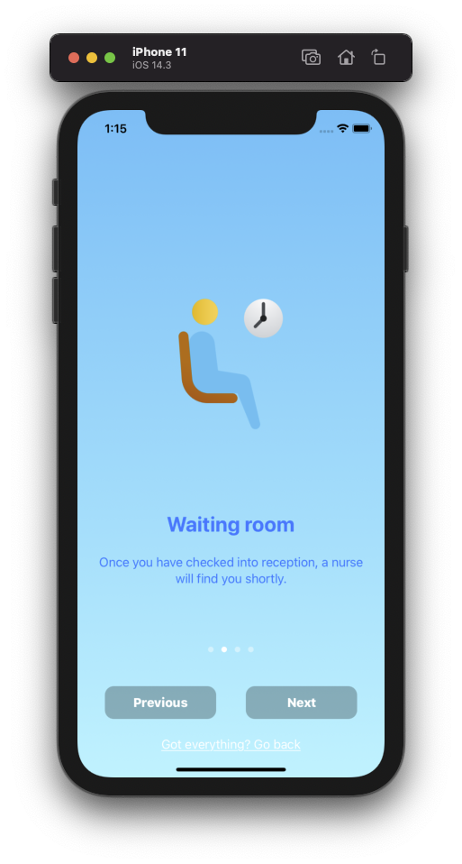

# Project Part 1 Prototype 
## 1) Background
### Updated description
Clear Skies is an app that is being created as a part of my ENGR489 honours year project and designing with the help of my SWEN303 assignments. Clear Skies is still fundamentally an app that will focus on better mental health for young people. However, the solution discussed in the first assignment has deviated since then. 

The initial idea was a solution that would serve to educate young people on mental health concerns. The app had intended on doing this through information on mental health topics and testimonials of other people’s experiences with them. After further research, reviewing existing solutions and meetings with stakeholders, we came to the realisation that existing solutions had already achieved the previous intentions of the app. 
When creating an application, it is desirable to create an app with one of three things in mind. Either create a better version of another app, innovate an existing solution, or create something unique. This is done to avoid creating an identical copy, or a solution that is worse, or a solution that does not offer any added benefits to existing solutions. With the time frame given for the app, it is infeasible to create a solution that would be significantly better or an app that would innovate an existing solution. Instead what was decided after further research, was that we would identify a unique, new and niche app. 

The conclusion derived from further research would be to create an app that aims to help specifically young people with mental health concerns in the emergency department. This is further discussed in the sections below. 

### Existing solutions 
The existing solutions researched before still hold relevance to our app. As described in the updated description, although the intended solution has changed, the problems still remain relatively the same. The target audience is still the same, and although we are creating an iOS application, it is still valuable to critique web applications with similar goals in mind as Clear Skies. Please refer to assignment 1 where initial research had taken on these three apps. Below is further evaluation done on existing solutions. 

**2.2.1 The Lowdown: https://thelowdown.co.nz/**

The Lowdown is a local, popular application for mental health support. They target young people however, anyone of any age could gain something useful from this. The Lowdown confronts issues in a very real way, they have photos, videos, and stories of individuals who have gone through concerns regarding mental health. This is to show that this is a real topic, instead of being a service that just shows positive imagery constantly. As someone who has needed support for mental health, I can definitely vouch for how they tackle concerns in a real way. The Lowdown team is “an experienced group of counsellors, who are available 24/7”. 

| Good | Bad |
| ------ | ------ |
| Has an abundance of both informative topics, and testimonials for a user to view. | Too many options can be confusing for a user to select the most suitable part of the app for them. |
| Has real imagery and text. It does not sugar coat topics and is digital assistant people can relate to.  | Topics are very word-based. Would be much better to have more diagrams to guide explanations. |
|They have reputable sources, and is a team of “experienced group of counsellors, who are available 24/7”| The name of the website seems a bit negative. It adds to the realism which is good, but something a bit more uplifting may be more inviting. |

**2.2.2 ReachOut: https://au.reachout.com/**

ReachOut is a popular online service in Australia for “young people and their parents”. The information that is provided on their service is largely about mental health support and displays it in a way for parents in particular to help their teenagers. Their target audience is individuals who need mental health support between the ages of 14-25 and their parents. 

The service offers three levels of support for both the parents and individuals between the ages of 15-25 They also have support for schools and offer more tools and apps that they have sponsored through the donations they receive. The service itself is more popular in the form of a website, however is also available as an app. 

| Good | Bad |
| ------ | ------ |
| Big urgent help button - visually clear. The urgent help page is nicely formatted with an abundance of other resources to use.  |A jarring juxtaposition of the colours blue, pink, and yellow. |
|A nice simple “What’s on your mind?” section where you can select multiple topics of interest or concern for a user. | The “NextStep” section requires a lot of thought to complete the quiz-like structure. |
|Help available for parents and schools | There is too much going on, on the home page. There are articles and “trending topics” which do not seem appropriate for this. |

**2.2.3 Aunty Dee: https://www.auntydee.co.nz/**

Aunty Dee is another non-government organisation online service that gives information regarding mental health. It shows tips and tricks, as well as offering support to users if needed. 
However, unlike the other existing solutions shown, it primarily focuses on how to find a solution to your problems. 

Aunty Dee recommends a 3 step routine to try to find a solution to your problems. The first is to list your problems, the second is to generate ideas, and the third is to find a solution. 

| Good | Bad |
| ------ | ------ |
| Inclusive to a diverse ethnic crowd (Maori and Pacific individuals specifically) | The three-step process shifts the responsibility to finding a solution to the user, rather than the app providing answers for specific scenarios. |
| Very simple and easy to use. No long paragraphs or overcrowding of features. | The three-step process also means that there is no unique solution to people’s different mental health concerns. |
| Gives tips and tricks to look for help. Also recommends other resources to look at and use. | You can only choose one problem to try to solve. Many people would have more than just one problem of concern. |

### Discussions with stakeholder
We have had two meetings with a representative of our stakeholders, S. a female nurse that works in the emergency department at Wellington Regional Hospital. Initially, In our first meeting with S., we got to understand the problem in a much better context. After meeting with her the first time, our focus had become to make an application catered to helping provide information to young patients with mental health concerns. 

But after doing background research, as shown above, we found existing solutions that solve the problems we had outlined, with the support of professionals. These existing solutions solve our problem much better than we would get the chance to within the scope of this project.  

Our aim is to create a solution that is better than existing solutions or solves a problem that has not been tackled before. This was brought up in the second meeting, following the review of existing apps and solutions, where we further refined the problem space with S. After doing so we were able to outline the functional requirements of the app. By doing so, we had finally come up with revised solutions that solve unique problems. The business objectives were derived from these meetings as well as other literature research, which can be read below. 

### Business objectives (Importance of the system)
**Main objective:**

This project was to design and create an iOS application that could be used for young patients that struggle with mental illnesses after being discharged from the emergency department. However, the application now aims to be used for patients in the emergency department as well, rather than just after they have been discharged.

The solution will continue to keep patients well informed, and may potentially keep the hospital up to date on the patients well being. The original solution was to give the application to them upon ED discharge in the hopes they do not have to visit the ED again [3]. Now we believe it would be better to give the application to them upon arrival of the ED to relax the anxieties people may face inside the ED.

### Functional requirements / how the objectives will be achieved:

**Through the literature review and existing solutions research, the following revised solutions for the app were derived (in order of importance).**
1. Provides information on ED and what to expect as patients are in the waiting room in the ED.
2. Has emergency contact details which should be accessible on every page.
3. Has links to other resources. We don't need to remake useful resources such as The Lowdown.
4. Provides mindfulness tools that help to self-manage distress/stress/anxiety, e.g CBT resources.
5. A way for patients to log the information that is being provided by doctors to keep notes. 

**Potentially in the future, the app can include:**

1. Notifications to remind users to take medication or to check up on their health. 
2. A follow-up or chat option

**Resources needed:**
I will be using XCode and Swift for my iOS app. This should be free and accessible to me using the Mac Mini I will have been assigned for this project. However, joining Apple's developer program and then uploading to the app store costs $99 per year if I choose to do so [9].

## 2) Personas. 

### Sam (they/them), 19, University student - Potential self-harm 

Sam is a university student who has a lot of friends at university and has no trouble getting along with people. 

Lately, however, some of Sam’s extended family have not been the most accepting. Usually, this does not affect Sam, but for some reason, this one has gotten to them. Dark thoughts have manifested Sam and they feel like they need help to get their head out of the clouds. 

Sam had recently gone to the emergency department unfortunately due to self-harm reasons. Sam cannot remember too much from the situation but they did remember to download Clear Skies in order to help prevent them from finding themselves in the emergency department again. 

**Activities**: Sam loves hanging out with their friends, going outside, thrift shopping and photography. 

**Attitudes**: Sam believes that everyone should be treated equally. The most important thing to them is that everyone is respected. 

**Aptitudes**: Sam is a creative and loving individual. They are extremely empathetic about others and loves the unique things about each different person. 

**Weaknesses**: One weakness that Sam has is how empathetic they are. This usually is a great thing, however for Sam, it means that they overlook their own well-being, and instead cares more about the people surrounding them. 

**Domain Knowledge**: Sam is very aware of mental health topics and looking after themself. Sam has used similar apps and has been to counselling before. As aware as Sam is of these topics, they can always learn more about their current situation and try to find ways to improve themselves. 

**System Knowledge**: Sam has used the lowdown in the past and has really enjoyed how they display their information in such a relatable way that is not sugar-coated. 

**Interaction**: Sam will use the app whenever they have bad thoughts to help with their current situation. This will usually be at night when Sam is not surrounded by their friends or family. 

**Priorities**: Sam’s priority using this app would be to find other ways to deal with her depression.

**Motivations**: Sam’s motivation for using the app is to understand what they are going through so that they can find ways to stop it, feel happier, and achieve better mental well-being. 

**Computer self-efficacy**: Sam uses her iPhone every day and is very comfortable with it.

**Risk tolerance**: Sam is sensitive to the topics discussed on this app, their risk tolerance is low. 

**Information Processing**: Sam processes information quickly and remembers details, especially in situations where they must apply the learned knowledge. 

**Tinkering**: Sam will explore the app as much as necessary to help themselves. This app will help them find a solution and therefore they will tinker with most of the app. 

---

### Aroha (she/her), 16, High school student - Anxiety Disorder

Aroha is a 16-year-old High school student who has recently been a victim of bullying. Aroha also recently discovered that she has an anxiety disorder, due to a severe panic attack, which took her through to the Emergency room. 

While in the emergency department, Aroha has managed to get herself into a slightly calmer state of mind and is able to follow the nurse’s recommendation of downloading the Clear Skies app to help ease her anxiety in the waiting room.

**Activities**: Aroha enjoys her alone time which includes reading, playing guitar and cooking.

**Attitudes**: Aroha believes that you should treat others how you want to be treated. She believes in the kindness of others, and that good karma comes back around if you give it out. 

**Aptitudes**: Aroha is enthusiastic about learning and enjoys being organised. She keeps to herself, and enjoys doing tasks ahead of time so that she has more time to spare in the future. 

**Weaknesses**: Aroha gets stressed very easily, and due to her disorder, she is much more susceptible to feeling anxious.

**Domain Knowledge**: Aroha has taken a couple health classes previously, however, as a teenager she has not seen or experienced anxiety as vivid as what had happened last time. 

**System Knowledge**:  Aroha has used meditative apps that help relax the mind, however has never used anything else related to anxiety or the emergency department].

**Interaction**: Aroha will interact with this app any spare time she has away from other people. 

**Priorities**: Aroha’s priorities would be to see what she could do to improve her current situation. This would mainly be by looking at testimonials and seeing how others dealt with bullying. 

**Motivations**: Aroha uses Clear Skies to ensure another severe panic attack does not happen or at least understand it enough so that next time it is not as scary as experiencing something that has never happened before. 

**Computer self-efficacy**: Aroha loves being on her phone and computer and keeping to herself. 

**Risk tolerance**: Aroha has a low-risk tolerance. A lot of things can trigger a panic attack with her anxiety disorder. The app must look and feel inviting without a negative tone. This is something to be careful of when using the app in the waiting room. 

**Information Processing**: Aroha can read quickly however it takes time for her to fully grasp an understanding of deeper details. 

--- 

### Zoya (she/her), 43 - Concerned parent 

Zoya is a concerned parent who wants to do her best in order to protect her children. Zoya’s eldest child was recently taken into the emergency room due to a mental health concern. 

At the emergency department, Zoza had downloaded the Clear Skies app as the nurses had recommended. In her time there this had helped take notes of the events. 

After the recent scare at the emergency department, Zoya wanted to be as informed as possible to protect her child. Zoya wants to do whatever she can to prevent her child from being admitted into the ER again. 

**Activities**: Zoya enjoys cooking, gardening, and spending time with her children and family. 

**Attitudes**: Zoya believes that her family is the most important thing in her life and will do anything to help and or protect them.

**Aptitudes**: Zoya is generally a very caring person. Her motherly instincts kicked in long before she had kids. She is naturally good at looking after others and making them feel safe. 

**Weaknesses**: The biggest weakness is that sometimes her love and care can sometimes come out as looking like she is controlling. This is a weakness because she wants to care for her son and understand his situation more without him feeling like Zoya is too controlling.  

**Domain Knowledge**: Zoya does not have much knowledge on mental health and concerns relating to it. It was such a taboo topic back in her youth in India where she was born and raised. 

**System Knowledge**: Zoya has not used Clear Skies or anything similar to the system. This is the first time she is trying to understand what her child is going through and what she can do to help. 

**Interaction**: Zoya will use the app only when she has spare time. She obviously cares for her child, however, she also cares about the rest of her family and understands her responsibility for providing and looking after everyone. Unfortunately, there can’t be two Zoya’s. 

**Priorities**: Zoya’s main priority is understanding the trouble her child is going through and trying to find ways to prevent the previous scare from happening. This could be through the help of general information given for each concern in the app, and or testimonials.

**Motivations**: The motivation for Zoya to use this app at all is for her child. She uses this in the hopes that she is able to help her child improve their current situation, or prevent another scare from happening again. 

**Computer self-efficacy**: Zoya is not very good with using apps or the computer. She is a bit too old and out of touch with technology. 

**Risk tolerance**: Zoya’s risk tolerance is very high. She is determined to get her child better and will not shy away from any topic.  

**Information Processing**: Zoya processes information very quickly.

**Tinkering**: Zoya does not enjoy tinkering much. She is straight to the point and goes with the flow rather than trying to swim against the currents. 

---

### Greg (he/him), 23,  Software Engineer - Substance abuse. 

Greg is a 23-year-old second-generation Vietnamese Kiwi who graduated last year and is now working full time. Greg is currently suffering from a great deal of stress due to a recent breakup, and work as he has not been very motivated to perform at the level he is normally able to achieve. Due to this, Greg had gradually started to abuse alcohol in an attempt to try to feel better. 

Unfortunately, Greg had drunk too much one night and was admitted into the hospital via the Emergency Room. After being treated safely, the nurses have now suggested he downloads the Clear Skies app in order to keep him informed about what is to come and to help him afterwards. 

**Activities**: Greg used to be passionate about picking up new hobbies very frequently. For example, he loves skating, playing the guitar, and solving a Rubix cube.

**Attitudes**: Greg is very straight to the point and does not like to beat around the bush. Greg usually only focuses when a task is very important or has a due date coming up. 

**Aptitudes**: Greg has a great memory. Any information spat out to him sticks to him like glue. 

**Weaknesses**: Greg gets over-confident with things and leaves tasks to the last minute. Greg also has quite an addictive personality, which is great for picking up hobbies, but not so good with other things. 

**Domain Knowledge**: Greg took a psychology paper that talked about addictions and other mental health concerns. Greg has never been to the emergency department before.

**System Knowledge**: Greg has never used an app or any technology related to mental health concerns or for the emergency department. 

**Interaction**: Greg does not have anything better to do these days, and also feels as if he needs to get his life back on track as fast as possible. Greg will download the app and ensure that he understands his current situation to prevent this from occurring again. 

**Priorities**: Greg wants the app to be easy to navigate. He especially wants to find more information on his condition, and ways to help him out, very quickly. 

**Motivations**: Greg is using Clear Skies for him to understand his condition better so that he can prevent his condition from worsening. 
Computer self-efficacy: Greg had studied computer science and is skilled with using his iPhone.

**Risk tolerance**: Greg is quite thick-skinned. He understands the severity of his situation and in his mind, he has seen the worst of it. Therefore, Greg has a high risk tolerance for the subjects that are discussed in the app.

**Information Processing**: Greg processes and understands information quickly. 

**Tinkering**: Greg only tinkers when he feels like he has not gotten everything he needs. Usually, however, once Greg finds information to a point he is satisfied with, he usually stops there. 

---

## 3) Scenarios. 

### Scenario 1: Viewing information on the ED (ED Walkthrough)

**User**: Aroha 

**Context**: Aroha has just been admitted into the emergency department as she had started to have a panic attack. The situation inside the emergency department is making her more anxious than before. She is anxious about what is yet to happen so staff has told her to install this app to explain exactly what will happen.

| User | System |
| ------ | ------ |
| Opens the app for the first time | - |
| - | Asks the user if they are in the emergency department  |
| Selects “Yes” |-|
|-|Displays flowchart styled page, for the Emergency Department walkthrough |

---

### Scenario 2: Uses the emergency contact details 
**User**: Sam

**Context**: Sam is now scared of the situation that had occurred previously and is ensuring that they do not go through the same situation again. Sam however has dark thoughts creeping in their mind again and quickly remembers to check the Clear Skies app for help.

| User | System |
| ------ | ------ |
| Opens the app (not the first time) | - |
| - | Takes the user to the home tab - the first tab of the application |
| Clicks the dropdown to the emergency contact details | - |
| - | Displays list of contacts |
| Selects emergency contact to call | - |
| - | Phone pop up appears asking if the user wants to call the number selected. |

---
### Scenario 3: Using links to other mental health resources
**User**: Greg

**Context**: Greg is now back at home and has downloaded the Clear Skies app as recommended by nurses at the Emergency Department. Greg’s goal is to prevent a similar situation from ever occurring again. Therefore Greg is now using Clear Skies to help him understand his situation better. This is the first time Greg is using the app and just wants the information he needs. 

| User | System |
| ------ | ------ |
| Opens the app for the first time | - |
| - | Asks the user if they are in the emergency department |
| Selects “No” | - |
| - | Takes the user to the first tab (Home tab) of the application |
| Selects the second tab (resources tab) of the app | - |
| - | Displays two options, either “Mental health resources”, or “Mindfulness tools” |
| Selects “Mental health resources” | - |

---

### Scenario 4: Using links to other mindfulness tools 
**User**: Aroha 

**Context**: Aroha is back from the emergency department and has gone through the app a few times before. She simply wants a way to manage her anxiety in order to prevent a panic attack from happening again. Aroha has already read about anxiety and feels she does not need any more information on the topic itself. However, she would like mindfulness tools to help her manage her mental health concerns. 

| User | System |
| ------ | ------ |
| Opens the app for the first time | - |
| - | Asks the user if they are in the emergency department |
| Selects “No” | - |
| - | Takes the user to the first tab (Home tab) of the application |
| Selects the second tab (resources tab) of the app | - |
| - | Displays two options, either “Mental health resources”, or “Mindfulness tools” |
| Selects “Mindfulness tools” | - |

---
### Scenario 5: Logging information given by doctor inside the Emergency Room 
**User**: Aroha 

**Context**: In the waiting room, Aroha had managed to calm herself down enough so to download Clear Skies and even read through the emergency department walkthrough. Aroha has explored the app sufficiently. Now that Aroha is finally in the emergency room and has been treated, the doctor is now explaining what had happened and the treatments. There is a lot of information that Aroha isn’t processing right now so she wants to log all of it. 

| User | System |
| ------ | ------ |
| Opens the app (not the first time) | - |
| - | Takes the user to the home tab - the first tab of the application |
| Selects the third tab “Notes” | - |
| - | Takes the user to the third tab “Notes” |
| Selects the “Add note” button | - |
| - | Displays form for the user to fill out to take notes of the appointment in the emergency department. |

---

### Scenario 6: Viewing previous notes taken 
**User**: Zoya

**Context**: Zoya had visited the ER recently for her eldest child. During this visit, Zoya had taken notes of everything the doctor had said on the Clear Skies app. This was done smoothly after following the instructions of the nurses to do so. She now wants to view the notes taken before at the ER to help her child further.

| User | System |
| ------ | ------ |
| Opens the app (not the first time) | - |
| - | Takes the user to the home tab - the first tab of the application |
| Selects the third tab “Notes” | - |
| - | Takes the user to the third tab “Notes” |
| Selects previously taken note | - |
| - | Displays the previously taken doctors notes |

---

## 4) Designs ideation. 
Here is a link to the wireframes created. This is where I had created my designs and is the inspiration for the prototype I have created. 
https://www.figma.com/file/elQVtzVdXB0TD341iBsAXy/ENGR489?node-id=0%3A1

### Model overview

### Initial app start - Walkthrough 

The app will initially ask if you are in the emergency department. If you are, it will proceed with the following walkthrough

If not, the application will take you to the home page shown below. 

This is one of the three main tabs (**Home, Resource and Notes**). 

Below is the resources page. 

Here you have the option of selecting either Mental Health resources or finding Mindfulness tools. These are shown individually below.

Here resources are listed individually with a photo, title and a description. If you click on one of the listed resources a pop up appears showing a description and asking if you want to be redirected to that resource as shown below. 

Another thing to note is the "Need urgent help now?" button. This button will be on the top right of every screen apart from the walkthrough and the home page (where it is in the middle of the screen). If you click this button it will take you to the following page. 

The final tab to look at is the Notes tab. This is where you can make notes from your time with a doctor or nurse in the ER if you are in a state to do so. 

---

## 5) Design review. 
Through the evaluation of the designs in assignments 1 and 2, we were able to conclude on a model for the application that I will be designing. In assignment 2 especially we were able to prioritise and compromise solutions to create the model we have now. 

Now we are simply up to the design of this. I believe for the most part the system should function correctly, and most things should be a matter of aesthetics. We can confirm this by running a cognitive walkthrough with the scenarios listed above, and then doing an expert Heuristic evaluation on each of them. 

I have done a cognitive walkthrough of the scenarios by going through the design as described above, in the way that the six scenarios describe.

We will be using Nielsen’s Heuristics and the severity rating to rank the results of the cognitive walkthrough done using the scenarios. 
An image for reference is given below:

---

**H1	Visibility of system status**

`1	Cosmetic problem only: need not be fixed unless extra time is available on project`

The only confusing part of the application would be the starting walkthrough. This disrupts the flow a little as in it goes away from the main tabbed application experience. Other than that it is always clear where you are in the application as it is highlighted in the tabs, and there is always a back button if you have gone away from the main tabs. 

---

**H2	Match between system and the real world**

`3	Major usability problem: important to fix, so should be given high priority`

I believe this would be a great thing to focus on if given the time. The demographic for this application is a younger audience so perhaps I would need to phrase and include things that appeal to them more. I have already included imagery and slight informal phrasing however, more done would be better for the application. 

---

**H3	User control and freedom**

`0	I don't agree that this is a usability problem at all`

There is always a way to "undo" or "redo" an action. Any navigation can be taken back easily. The only exception for this is the redirection to another resource but there is a confirmation button for this. Any user who goes outside of the application is doing that at their own will or is a mistake, similar to closing the applicaiton. All you would have to do is come back. 

---

**H4	Consistency and standards**

`2	Minor usability problem: fixing this should be given low priority`

I believe that there is a mostly consistent usability theme. A lot of the application follows basic intuitive application desgins, or designs that are similar to Apple or Google. To make it more consistent may be to make it more in tune with Apple's iOS designs. 

---

**H5	Error prevention**

`2	Minor usability problem: fixing this should be given low priority`

There are only a limited set of pages you can go to, all of them are just navigations. There is almost no room for any errors. This must however be explored further. 

---

**H6	Recognition rather than recall**

`2	Minor usability problem: fixing this should be given low priority`

The only place I can see this being a problem is that the user has to remember that the walkthrough is on the home page. Other than that everything is based on recognition. Each new page you go to there is a description on that, usually with an image too. 

---

**H7	Flexibility and efficiency of use**

`1	Cosmetic problem only: need not be fixed unless extra time is available on project`

It would be nice to have shortcuts and hidden features for expert users. However the application right now does not have many end points regardless. Perhaps a swipe up for the walkthrough or a swipe down for the emergency contacts. This is a bit uneccessary but would be a cool feature to add. 

---

**H8	Aesthetic and minimalist design**

`1	Cosmetic problem only: need not be fixed unless extra time is available on project`

I think this is an area that could be worked on more. I have quite a bit of focus on this already however it will be refined further through usability tests. 

---

**H9	Help users recognize, diagnose, and recover from errors**

`2	Minor usability problem: fixing this should be given low priority`

Once again I am not sure if the application has any errors, however if there is, there would be no data errors as the app is not storing anything. It would be a minor annoyance if anything, but should error onto the tabbed pages regardless. 

---

**H10	Help and documentation**

`2	Minor usability problem: fixing this should be given low priority`

I have this for the walkthrough however I do not have this for the tabs on the main application. I would have thought this would be quite intuitive however a concise list of concrete steps could be beneficial for non experienced users. However the demographic is young people so most of them should. Though, tthis should still not be assumed. 

---

## Part 1 reflection
The working Swift application prototype is included in this Git repo. 

A video of this demonstration is given in the folder described below: 
`./videos/demo.mp4`

## 5.3) Reflection
### 5.31) Reflection on merging of the designs / finalising my designs
Although I am working on the application individually, I am a part of a team. This team consists of three other people, one being my supervisor, the other being my project partner, and the final being a stakeholder. Every week my supervisor and my project partner discuss the applicaiton with the stakeholder coming in for meetings every month as well. 

In the most recent stakeholder meeting we had discussed potential app ideas that I had designed on figma and the ones that we had concluded on were the ones shown above. 

The most popular design they had liked was the walkthrough which they had felt was simple and could benefit a lot of individuals in the waiting room. This was good as this was one of the prioritised functional requirements. Choosing the theme for the application was discussed in the previous assignment where we had chosen blue to keep a calm theme. These were a few things that we had agreed upon. 

Where we had discussions upon was the home page, the resources page and the emergency contacts. In the home page the stakeholders both had agreed that a more symetrical approach was a better alternative. I had disagreed to this as I believed in consistency of the application, and iOS apps in general where things are alligned to the left. In the end I had to create a banner and center the title as we see in the home page. This was a compromise created, as I feel I have a bias towards my app and majority of the people had voted for a symetrical aesthetic. This is shown below as well as a reference. 

Another finalised design was the initial resources page. There were two options for this, either creating two more tabs within the screen as shown below:

or to create a design with two large buttons:

The large buttons was more appealing to us as it makes it more clear that there are two distinctive options to choose from. The two tabs also was not appealing as the application is already tabbed, and having more layers would make the app look too complex.

The final decision made was to create a new screen for the emergency contacts. This is opposed to creating a popup. We belived a dedicated page for this would be more appropriate as the demographic for this application is for people who have visited the ER before or are currently in the waiting room. This makes it more likely they would need urgent help at some point once again. This is why we believe a full screen was more appropriate as shown below: 

### 5.32) Best and worst parts of the prototype
In order to do this, I had attempted to do a cognative walkthrough as all the personas listed. I believed at first that Greg would be the easiest to walk through the app however this seemed to be quite the opposite. 

#### Best
The application showed its best features when walked through as Aroha and Zoya. These two are very invested users who would spend a lot of time tinkering throughout the application. This was good as the walkthrough was informative, and then after that they were taken to the home page where they could explore everything themselves. This would have been a great experience for them.

The best part by far of the application was the walkthrough. It turned out to be much more aesthetically pleasing than originally designed. This is thanks to SwiftUI code for making it look professional. It gives buttons as well as the option to swipe through the screen all on the first time you open the application. The walkthrough also transitions from the bottom of the page which is pleasing to see. The only complaint would be that the shaded dots are hard to see (for knowing what page in the walkthrough you are on).

The emergency contacts also turned out just as good. Another seperate page that has a neat transition away from the main tabs of the application. 

The listing of resources on seperate pages was nice to make. The overall aesthetic of the application was really nice, with the calm light blue theme throughout. There was a clear consistency with minimalist designs throughout the application. 

Errors were prevented in the application. There were no errors that I could find running through the application. 

#### Worst
Greg and Sam are two users who would want to get straight into the resources and not mess around with much else in the application. This meant bad news for them when they had first opened the app. Greg and Sam had to sift through the walkthrough to finally exit, where they were brought to the home screen. From there they had to click on the resources tab followed by the resources they were interested in. Although they can click the skip button on the walkthrough, this would have been way too many clicks to get from intro to the core functionalities of the app. Potentially something else needs to be done about the forced walkthrough. 

Although we had mentioned previously that the consistency of the app was good, the only downside was perhaps the application was a bit too minimalistic. It seemed a bit bare bones and needed more inside it. I am not too sure what else to add to it however. 

The note taking tab is a bit harder than I would have liked, and the aesthetic as now changed from the Google theme planned to the iOS way. This is not neccessarily a bad thing however as it brings more consistency to the theme of the application. The note taking app is still under development, and will go into next trimester in order to create a full working prototype. 

Another feature I had disliked was the transitions between tabs. They were instantanious and difficult to change. 

# Part 2 Testing and Reflection
## 6) Usability Test plan:
### 6.1) Methodology - How many users and what you are testing
I will be testing with four users. The first two will be for a pilot study to ensure the test is valid. I will be the moderator for the tests. The test will take place in Victoria University of Wellington, Kelburn Campus, Cotton Building, Room CO140. The tools being used for the participants interaction with the application will be a simulation run on in XCode for the Swift application on the Mac Mini. The data collected will be demographic information, satisfaction assessment, and suggestions for improvement. 

We will be using a PSSUQ questionnaire that includes 16 short and easy-to-understand questions asking about the user experience and about how the app could be improved. This includes the following 16 questions

1. Overall, I am satisfied with how easy it is to use this system.
2. It was simple to use this system.
3. I was able to complete the tasks and scenarios quickly using this system.
4. I felt comfortable using this system.
5. It was easy to learn to use this system.
6. I believe I could become productive quickly using this system.
7. The system gave error messages that clearly told me how to fix problems.
8. Whenever I made a mistake using the system, I could recover easily and quickly.
9. The information (such as online help, on-screen messages, and other documentation) provided with this system was clear.
10. It was easy to find the information I needed.
11. The information was effective in helping me complete the tasks and scenarios.
12. The organization of information on the system screens was clear.
13. The interface of this system was pleasant.
14. I liked using the interface of this system.
15. This system has all the functions and capabilities I expect it to have.
16. Overall, I am satisfied with this system.

PSSUQ score starts with 1 (strongly agree) and ends with 7 (strongly disagree). The lower the score, the better the performance and satisfaction. Users are asked to rank each question from 1-7. From there I will be collecting data and averaging sections as described below. 

- Overall: the average scores of questions 1 to 16
- System Usefulness (SYSUSE): the average scores of questions 1 to 6
- Information Quality (INFOQUAL): the average scores of questions 7 to 12
- Interface Quality (INTERQUAL): the average scores of questions 13 to 15

For more informaiton please visit:

https://uiuxtrend.com/pssuq-post-study-system-usability-questionnaire/

Participants may also be asked to provide free form comments about parts or all of their experience such as if the app is triggering any emotional distress if the app does not feel aesthetically pleasing or to note any difficulties they found in using the system. This will be done either in a post­ experiment interview. The information and feedbavck will be accessible only to members of the research team that carries out analysis and writeup. 

### 6.2) The script - What you say to the users
**Purpose:**

The purpose of the usability tests are to try and identify any unknown errors, understand perspectives on aesthetics and usability from an unbiased user's experience with the iOS application. The responsibility as a participant will be to attempt to complete a set of representative task scenarios precented to you in an efficient and timely manar as possible, and to provide feedback regarding the usability and acceptability of the user interface. You will be directed to profvide honest opinions regarding the usability of the application and to participate in post-session subjective questionairs and debriefing. 

**Problem statement:**

Clear Skies is an app that is being created as a part of my ENGR489 honours year project. It is an app that is aimed to be used in the emergency department of the hospital. The problem that the emergency department faces is the overcrowding of people in waiting rooms. One contributing factor to this is young people with mental health concerns. There are a lot of young people with mental health concerns that come into the hospital, and quite often, it is not their first visit. We want to implement an application that will help individuals in the waiting rooms to ease their anxieties and to provide them links to other resources. This is in the hopes that an individual will download the application in the waiting room of the emergency department, and keep it for later benefits, and to prevent them from visiting the hospital again. 

**Test environment:**

I will be testing with four users. The first two will be for a pilot study to ensure the test is valid. I will be the moderator for the tests. The test will take place in Victoria University of Wellington, Kelburn Campus, Cotton Building, Room CO140. The tools being used for the participants interaction with the application will be a simulation run on in XCode for the Swift application on the Mac Mini. The data collected will be demographic information, satisfaction assessment, and suggestions for improvement. 

**Monitor role:**

My role as the monitor is to facilitate these tests, as well as ensuring the tester does not get stuck. My role is also to list down any data I may find useful for the application in terms with how you interact with the application. 

**Data collection:**

Data collected will simply be the facilitator watching over your actions with the application, and writing down notes based upon this. They will also be timing you.

### 6.3) Roles - Who is doing what
Because this is an individual project, I will have to take up several roles. There is no need for a Facilitator, a silent observer would be nice if it was available but I have to take up multiple roles. It would have also been nice to have an impartial moderator if it was available. 

**Nalin will take the following roles:**

**Facilitator**

- Provides overview of study to participants
- Defines usability and purpose of usability testing to participants
- Assists in conduct of participant and observer debriefing sessions
- Responds to participant's requests for assistance
---	
**Data Logger**

- Records participant’s actions and comments

---

### 6.4) Tasks - What are you testing
**Task 1)**

The first task is to ensure that it is usable and all points of the application are easily found. As my application does not have many end points to it, I have decided the task to be more open ended. I want a user to try to explore all the possible end points of the application. There should be 4 of them excluding the tabs themselves. Each should take no longer than 30 seconds to find. I will tell users to return or go to a new page if they have correctly identified an end point. The four end points are the emergency walkthrough, the emergency contacts, and then both of the resources. 

The first test is that **the user should identify all four endpoints before three minutes is up**. I will record the time stamps at which they identify each end point. 

**Task 2)**

The next task would be to assign the test user with a persona in mind and give them one of the six scenarios mentioned above to complete. This is a specific task and it is more about the level of understanding/satisfaction the user gets from completing this task. Therefore for this there will also be a genorous three minutes. Here I will be testing how fast they can get this done by. 

### 6.5) Metrics - How you are measuring
I will be examining three main metrics. 

1. **Scenario completion:** I will be seeing if the user is able to complete the scenario before the time of 3 minutes. Any time after that would be considered a fail. 
2. **Scenario completion time (Time on Task):** The pilot tests should give me an indication of if I need to deviate the time given to complete the tasks. It will also help me understand if some tasks are more intuitive than others.  
3. **Subjective evaluation:** I will be looking at two evaluations. First will be the PSSUQ average scores. I will then also be recording, any other free form comments they are willing to make about the application. This evaluation is to take place after both tasks for the user. 

I will also be looking at non-critical errors, but only if it is a repeated non-critical error. This may signify parts of the application that can cause frustrations. Critical errors should not happen under any circumstances.

### 6.6) Usability Goals - What is the level you are happy with on the above metrics

**Scenario completion:** I will be looking for 100% scenario completion for all users. Any less than that indicates that tasks are too hard to execute. 

**Scenario completion time (Time on Task):** I will be happy if all tasks are completed under a 3 minute mark. This time may need adjustments based on future tests. 

**Subjective evaluation:** I am more than happy to take any feedback on how the application can be improved. I will also be very happy to get below (the lower the better) than the following results for the PSSUQ questionnare:
- SYSUSE: 2.80
- INFOQUAL: 3.02
- INTERQUAL: 2.49
- Overall: 2.82 

These averages were derived from 210 individuals and 21 studies. 

https://uiuxtrend.com/pssuq-post-study-system-usability-questionnaire/

### 6.7) Problem Severity - How bad are the problems
To prioritize recommendations, a method of problem severity classification will be used in the analysis of the data collected during evaluation activities.  The approach treats problem severity as a combination of two factors - the impact of the problem and the frequency of users experiencing the problem during the evaluation.

**Impact**

Impact is the ranking of the consequences of the problem by defining the level of impact that the problem has on successful task completion.  There are three levels of impact:
- High - prevents the user from completing the task (critical error)
- Moderate - causes user difficulty but the task can be completed (non-critical error)
- Low - minor problems that do not significantly affect the task completion (non-critical error)

**Frequency**

Frequency is the percentage of participants who experience the problem when working on a task.
- High: 3-6 or more of the participants experience the problem
- Moderate: 1-2 of participants experience the problem
- Low: 0 of the participants experience the problem

## 7) Usability Test Results
### 7.1) The results from the tests, based on metrics, compared to goals and how severe each issue is.

#### Task 1) Completing the app 
**User 1 comments:**

User 1 had commented on how straight away there was no context given to the walkthrough and that you were simply thrown into it. There should be a page welcoming individuals to the Clear Skies app. Perhaps even something to ask if users want to walkthrough or if they do not. Other comments they had were that the home page did not make too much sense to them. As basic as the buttons on the home page were, there was not much text describing exactly what would happen when you click those buttons. That in itself felt more like a questionaire than an app that is specifically trying to cater or help an individual with mental health concerns. This user did say though they liked the resources tab being very simple and clear with two buttons, and they did like the simplicity and minimal features as it did not make it overwhelming to test the application. Along with this though they had stated that there were quite a few white spaces in the prototype where there wasnt anything going on.

**User 2 comments:**

User 2 had struggled with the walkthrough slightly at the end where they expected an end button, or that the next button should do something at the very end. It took them one attempt to find out that the "Go home" button was at the bottom of the screen in white. They said that this was hard to see, and that the previous or next buttons should not exist when there is no where to go. Coming into the application they enjoyed the buttons a lot more. They had also taken their time to see the emergency contacts button on the top right of the resources screen, however, they had also enjoyed this page. Another comment made was that the resources page did not have many resources to choose from, and imagining it with more resources there would have been better to understand how the pages would feel. They had also said that the cards that you click on in the resources were not of consistent sizes and it would be useful to add a bit more description to each of them. 

**User 3 comments:**

User 3 had pointed out also that the colour scheme of the application was unusual. They could not point out why but they did say to follow examples of facebook or twitter or instagram and otehr social media appilcations. They are normally white and black with subtle hints of other secondary colours. Other than that they had said the feel of the application seemed professional with nice transitions. However the navigation still felt a bit unclear outside of the tabbed screens. They had also mentioned that the big buttions with icons in the resources page were nice as it was clear at what it was about. They said the first page did not need such a big title, and could be more subtle like the other tabs. 

**User 4 comments:**

User 4 had commented on how it was easier to explore the whole application first before doing the individual task assigned to them. This was because they had gained familiarity with the application, before trying to whatever else was thrown at them. They said they enjoyed using the app and were surprised at how professional some of the transitions felt. They did however feel that the big buttons were not so professional, however it could be for added benefit for stressed patients in the waiting room. They also felt that the app needed more consistency, this meant in centering, font sizes, button types and image types. This was a comment that I had gotten before as well and is certainly something that I will need to improve on in the future. 

**Task 1**

Users had next to no problems with navigating throughout the application and doing all that was possible. The first user had completed the application in 2 minutes and 52 seconds, which indidcated to me that users needed slightly more time to complete this first task. Therefore an extra minute was given to users 3 and 4, who had spent their time a bit more comfortably with the application, knowing they had time to explore.

| User | Scenario completion |  Scenario completion time | 
| --- | --- | --- | 
| User 1 | 100% | 2m 52s | 
| User 2 | 100% | 2m 37s | 
| User 3 | 100% | 3m 40s | 
| User 4 | 100% | 3m 20s | 

**PSSUQ Scores** 

A link to the PSSUQ results is given here:

https://docs.google.com/spreadsheets/d/17Mr0CqFyVviJTLC7JhaGNkl_1dyAZL-Til1m1JKiik4/edit?usp=sharing

| - | User 1 | User 2 | User 3 | User 4 | Averages |
| --- | --- | --- | --- | --- | --- |
| **SYSUSE (1-6)** | 2.333333333	| 4.166666667 |	1.5	| 1.333333333 | 2.333333333 |
| **INFOQUAL (7-12)** | 5.833333333	| 4.333333333	| 2.833333333 |	2.166666667 | 3.791666667 |
| **INTERQUAL (13-15)** | 4	| 2.666666667	| 1.666666667	| 2 | 2.583333333 |
| **PSSUQ Overall (1-16)** | 4.0625	| 3.875	| 2 |	1.75 | 2.921875 |

**Comparason to expected averages**

As we can see with the PSSUQ quiz done for each of the 4 users, we get an average accross the 4 metrics that are all slightly above the ideal averages we had aimed for apart from SYSUSE (System usefulness). These averages are given below once again. 

- SYSUSE: 2.80
- INFOQUAL: 3.02
- INTERQUAL: 2.49
- Overall: 2.82 

System usefulness were questions 1-6 where users had generally indicated that they were satisfied with using the system and found it relatively easy to use. The average score for this was 2.33 beating the goal of 2.8. 

For INFOQUAL (Information quality) the users had everaged 3.79 which was much greater than the par score of 3.02. This was for questions 7-12 that generally indicated that the information that was given throughout the application on how to interact with it was not as good as it could be. This means that for things such as buttons I could potentially have more of a description based on what it does. This could just be in smaller text but having that information there might help and encourage users to explore something when they know about it. 

Interface quality, or INTERQUAL, was given quite a good score of 2.58 which was just over the expected goal of 2.49. From this I had learned that the interface and experience with interacting with the application was quite good and does not need much more to work on. User 4 had rated this as a 4 which is nuetral, whereas users 2 and 4 were 2.6 and 2.58 respectfully. User 4 had mentioned that they had rated all three of the interface quality as average as that is what they felt like it was at the time. However they now feel like it was slightly harsh, but they were expecting the application to be more fluid and dynamic as other apps have with swipe gestures and scrolling, whereas this application is just a lot of clicking. 

### 7.2) Issues that will be updated for the second version of the prototype - listed as issues in gitlab. These issues will be associated with group members.
There were no useability issues found in the application, all parts of the application worked as they should. 
Most changes needed were aesthetic issues. For example, most users had complained about the imagery not being appealing and for the most part looked tacky. Some users had complained about the colour of the application and how it perhaps should simply be white, as the blue theme is quite jarring currently. This makes sense as there are also quite a few iOS specific features in this application, and maintaining consistency would be desireable. 

I think the two main changes to the prototype that need to be imagery found in the home screen, more simple images/icons as found in the resources screen, and the next would be a lighter background colour. Anther good change would be to change the size of the images in the walkthrough. Both of these changes would result in a more intuitive, and appealing design. These changes will put the focus on aspects of the application that are more important than others.

## 8) Updated prototype based on user testing
I have now updated the application to suit the requests of the users and also to act upon the aspects of the application that they did not like as much. This is one iteration of this cyclic process, and throughout the next trimester I will be constantly updating my application to tailor the wants and needs of stakeholders, my supervisor and other testers. 

### 8.1) Clearly identified updates from the original update with text justification
Updates include the change in colour theme, addition of photos to buttons 

### 8.2) Description of the rationale for the updates and how they benefit the project

**Smaller images in the walkthrough**

The walkthrough images originally had much bigger images and took up the width of the screen. Initially I thought that this would be a good idea to leave all the focus on the imagery. However learning through stakeholder feedback, I found that having images this big were too jarring and looked unappealing. An example of what it looks like is given below:

After a few simple tweaks I was able to adjust the images to look much nicer in the page, which also allows for a lot more room for text for when I flesh out the walkthrough more. More text will be given once stakeholders from the hospital decide on what information to give out. 

---

**Colour**

The feedback received was that the background colour gradient was too bright and had taken away the focus that should be placed on other features of the appication. Here we can see what the background used to look like before. 

The changes made was greating a gradient which is a lighter shade of blue, going down to white. This makes the application look and feel more like other apps with a clean white background, allowing for a better focus on the rest of the application. 

---

**Consistent images**

The images before were not of a consistent theme, and some did not feel like they made sense in the walkthrough. An example of the waiting room is shown below: 

I had made them all black and transparent to allow for a more natural feel. I had also seen however that I was using SVG images that are available for all apple products. This meant that I was able to change the foreground to all of the icons to a light blue, which matches the theme of the application. 

I am using SVG icons that are available for all apple products. These look great and even blend in with the foreground colour that you choose, rather than just black. I had decided also to update the icons to match the colour scheme on the resources page. Below you can see what they used to look like in black, and what I have updated them to be now in blue:

---

**Add more resources**

Before there were not that many resources listed, and was hard to imagane that there was a list of resources. This is shown below:

I have simply added more in now so that it looks more full. This is to mock what the resources will look like once the stakeholders give me resources the hospital would recommend themselves. This is shown below:

---

**Consistent sizing of the resource cards**

The cards before were dynamic and were allowed to be of any size as shown below:

This has now been restricted to a fixed size as shown below:

---

## 9) Usability Test Discussion

The usability tests were a great way to get an unbiased perspective from individuals who used my app for the first time. This was useful information for me as for a lot of people the first time they use the application would be the most important. As the personas described, a lot of the time, the situation would be that the user is using the application for the first time in the waiting room of the emergency department. They would install the application and immediately be given knowledge on the process of the emergency department. Most people, such as the users in my tests, do not have much experience with going to the emergency department, and would not have much experience using a solution such as my application. Because the users in my tests parallel in some ways to people who would use my application, I believe I have received useful information on how actual users would feel using my application. 

### 9.1) What was the most interesting thing found from testing

The most interesting thing found from testing was seeing how much the users were impressed by the interface quality of the application. This was much thanks to SwiftUI for being able to develop such beautiful software with easy transitions and consistent features to use throughout the application. These features were similar to a few of my users and made it easier for them to recognise ways to use my application. I was a bit worried initially that the transitions would not be clear or would be undesirable. To my surprise however, the users seemed to love the big obvious buttons that made it extremely clear on how to navigate throughout the application. 

Another interesting thing that I had found through testing was that users liked more plain images rather than fancier ones. Personally I had liked images with a bit more colour and showed a more descriptive action related to what the button does. Users of the application seemed to prefer the more simple SVG icons that are used as apple icons. They were more generic and could be applied to a wide variety of buttons. This also means that users do not make major judgements or other alternate associations to what the button does. For example, the heart and the sun icons in the resources tab are generic icons that can be applied to a lot of things. Users generally liked these icons as these were ones that they have seen before and can make their own associations with them. 

### 9.2) What was the most significant result
The most significant result of the user testing experience was recognising that my app is a valid functioning prototype that simply needs aesthetic changes for the moment. There are not many functional changes to make other than the already recognised notes tab not yet being ready. This result was recognised as I was able to reach 100% scenario completeion, with all of them being under the given time. This was recognised through the user feedback saying mainly aethetic changes were to be made. These results were what was able to help me change the app, and help me into my first iteration of changes to the functional product. 

### 10) Experience with SWEN303 Process in developing my Application. 

The expreience with the process of researching, designing, implementing and testing has been something that will be extrememly beneficial to my project this year. This process is a standard procedure that I would have had to go through anyway. 

I believe this process has particularly helped me with understanding how a user would interact with my application, and understand what demographic would use this application. The process of making a model, persona and scenarios was something that really helped with this. Creating the prototype was fun, and was simple enough to be enfluenced easily by any major changes that I had in designing the applicaiton. This was useful for when I had made major changes to my solution in assignment 2 from assignment 1. It helped a great amount to dedicate so much into research followed by another iteration of research to ensure that I was making the app that was needed. 

The design of the application was also a great way to understand how my ideas can be implemented on an application. Functional requirements are easy to state, but designing an appealing way to do so was tricky. Designing the applicaition had also helped as I was able to bring it into stakeholder meetings and discuss the future of the application. The designs were made and improved through the approval of my stakeholders, so that I was able to do usability tests on them with unbiased perspectives. 

This process has not been easy due to the long waiting times between meetings with stakeholders, however I am glad that I was rushed into doing so. Through the process I was able to create a minimium viable product to test at the end of it all. 
